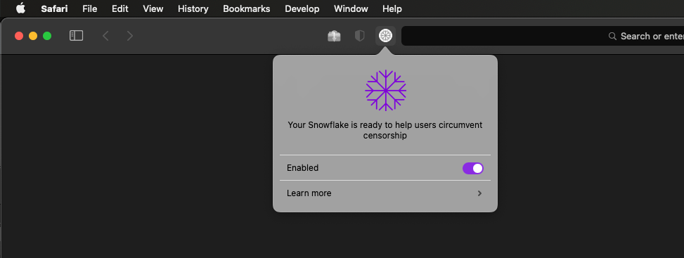
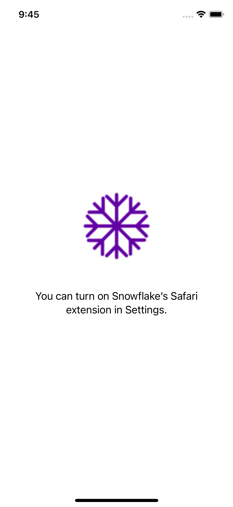
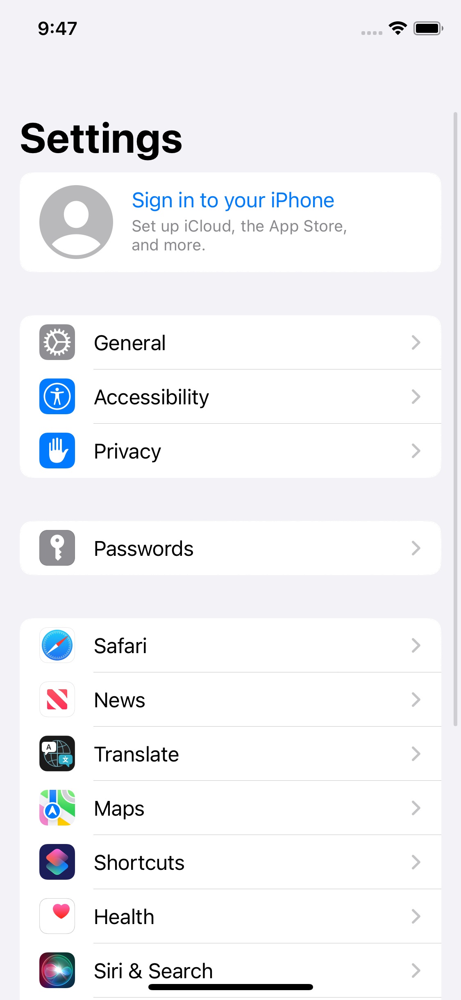
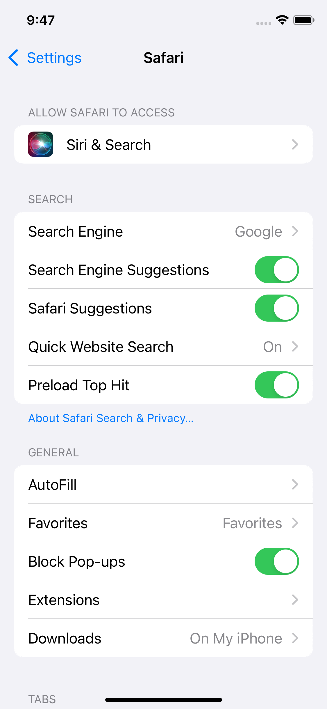
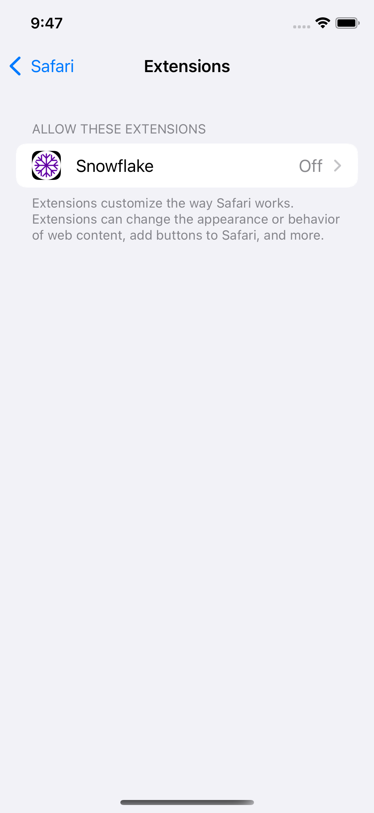

### Snowflake's Safari Extension (macOS/iOS)

	
	<h2 align="center">Snowflake</h2>

Snowflake is a system to defeat internet censorship. People who are censored can use Snowflake to access the internet. Their connection goes through Snowflake proxies, which are run by volunteers. For more details about how it works visit https://snowflake.torproject.org.

#### Desktop

#### Mobile
<table>
  <tr>
     <td>Launch Screen</td>
     <td>Enable Snowflake Extension in Setttings</td>
     <td>Go to Extensions</td>
     <td>Enable Snowflake Extension</td>
  </tr>
  <tr>
    <td></td>
    <td></td>
    <td></td>
    <td></td>
  </tr>
 </table>
