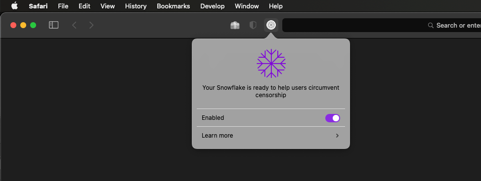

### Snowflake's Safari Extension

<p id="downloads" align="center">
	
	<h2 align="center">Snowflake</h2>
</p>

Snowflake is a system to defeat internet censorship. People who are censored can use Snowflake to access the internet. Their connection goes through Snowflake proxies, which are run by volunteers. For more details about how it works visit https://snowflake.torproject.org.

#### Installation
1. Download and and install the package.
<a href="https://apps.apple.com/us/app/torproject-snowflake/id1597501940" target="_blank">Download Snowflake Safari Extension</a>
2. Launch the Snowflake app after installation.

#### Development
1. Clone and build project with Xcode 13 or greater.
2. Install `gsed` using brew.
3. Enable "**Develop**" mode in Safari.
4. Allow unsigned extension.
5. Building the project.
```
cd snowflake
./build-safari-extension
```

5. Launch the application from **`extension/build/Release/Snowflake.app`**.

**NB:** If an error is encountered during the **`xcodebuild`** process, open **`extension/Snowflake.xcodeproj`** in Xcode, add a development team and rebuild the project.

<hr/>

#### Sample



#### Snowflake WebExtension - Tor Project
https://gitlab.torproject.org/tpo/anti-censorship/pluggable-transports/snowflake-webext
